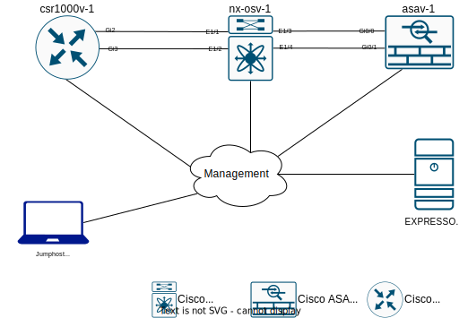

##########
Lab Access
##########

This lab includes a CML server which a simulation of the lab network will be running.
All lab tasks are intended to be executed from the Jumphost (a Windows 10 machine with WSL installed).

The lab topology is shown below:

|

.. _Lab Access Information:

IP Addressing and Access Information
====================================

.. csv-table::
    :file: ./reference/devices-info.csv
    :width: 80%
    :header-rows: 1

Component Details
=================

.. csv-table::
    :file: ./reference/component-details.csv
    :width: 80%
    :header-rows: 1

Get Started
===========

#. Use the following layout to identify your POD number.

|

    .. image:: images/pod-layout.svg
        :width: 75%
        :align: center

|

#. Use the following credentials to access the lab environment according to the POD assigned to you:

    .. csv-table::
        :file: ./reference/access-info.csv
        :width: 80%
        :header-rows: 1

#. Open ``Cisco AnyConnect`` client and copy the Host address or name from the previous table.

    .. image:: images/anyconnect-01.png
        :width: 45%
        :align: center

#. Enter the Username/Password from the previous table when the login fields appear.

    .. image:: images/anyconnect-02.png
        :width: 45%
        :align: center

#. Accept when the login banner appears.

    .. image:: images/anyconnect-03.png
        :width: 45%
        :align: center

#. Once you are connected to Cisco AnyConnect VPN `Show Me How <https://dcloud-cms.cisco.com/help/install_anyconnect_pc_mac>`__, use the local RDP client installed on your laptop to connect to the Jumphost using the information from the table above :ref:`Lab Access Information <Lab Access Information>`.
#. Once inside the remote desktop connection, open the Google Chrome browser, startup page https://cml-controller.cml.lab/login will be opened (web interface of Cisco Modeling Labs server).

#. Press ``Login`` button:

    .. image:: images/cml-01.png
        :width: 75%
        :align: center

#. Ensure the lab LTRATO-2001 is in the ``ON`` state on the opened page. If not, turn it on on the ``play`` button.

    .. image:: images/cml-02.png
        :width: 75%
        :align: center

#. Click on the topology ``the gray dots``, and on the opened page, ensure the status for all devices is ``green``:

    .. image:: images/cml-03.png
        :width: 75%
        :align: center

    |

    .. note::
        If the status of any device is not green 10 minutes after the CML topology has been started, refer to the lab's proctor for assistance.

#. On the remote desktop, double-click the ``PuTTY`` shortcut icon on the desktop and verify connectivity by launching three sessions for the **asav-1**, **csr100v-1**, and **nx-osv-1** devices and logging in. Username/password for all three devices: ``cisco/cisco``.

#. If all devices are reachable and you can log in, close the PuTTY sessions and proceed with **Task 1**.

.. sectionauthor:: Luis Rueda <lurueda@cisco.com>, Jairo Leon <jaileon@cisco.com>, Yossi Meloch <ymeloch@cisco.com>
