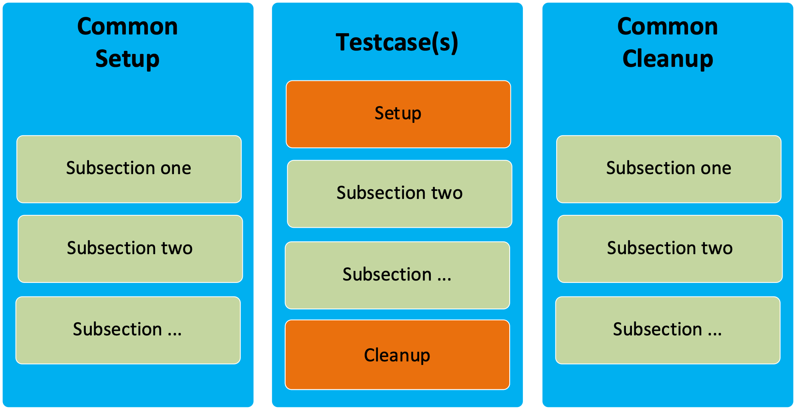

Step 2: Writing Test Script
############################

**Value Proposition:** Now we will write our first test script on Python using the pyATS library. Our test script will connect to all the devices in the testbed and print the results of the connection. If the connections to all the devices are successful, then the test will pass; else, it will fail. Using this simple test script, we will learn the structure of the pyATS test script file.

The pyATS test script is a file in Python code which uses the pyATS library.
The structure of the pyATS test script is modular and straightforward.
Each test script is written in a Python file and split into three major sections (Python classes) – see the illustration below for a graphical representation:

- **Common Setup:** The first section of the test script, runnned at the beginning. It performs all the "common" setups required for the script.
- **Testcase(s):** A self-contained individual unit of testing. Each testcase is independent of the other testcases.
- **Common Cleanup:** The last section in the test script. It performs all the "common" cleanups at the end of execution.

Each of these sections is further broken down into smaller subsections (Python methods of the class).

.. note::
    There can be only one Common Setup and only one Common in a script, whereas there might be multiple test cases in one test script.

#. Let's verify our first test script. Open the file **task5_labpyats.py** and observe its structure:

    .. code-block:: bash

        nano task5_labpyats.py

#. Pay special attention to the following part of the code. Whereas it's not only related to this task, it will help you understand the logging capabilities of pyATS that will be used in other tasks during this lab:

    .. code-block:: python

        # Import of pyATS logging banner
        from pyats.log.utils import banner 

        <..>

        # This section sets up logging (ensure the log.level is the same or higher than 
        # level of log.info where banner is used)

        global log
        log = logging.getLogger(__name__)
        log.setLevel(logging.INFO)
        <..>

        # Use pyATS logging banner to format the output
        log.info(banner(f"Connect to device '{device.name}'"))

#. When the pyATS logging banner is used, the following format of message would be shown in the output of the test.

    .. code-block:: python

        Connect to device 'cisco_ios_xr_asr9k_01'

    .. image:: images/pyats-logger-banner.png
        :width: 600px
        :align: center

    |

    .. note::

        The pyATS logging banner itself does not perform logging, and instead it only performs style formatting of its input messages. Hence, the **log.info(banner("logging message"))** construction is used in the code for logging.
        Since the banner is logged with INFO logging level, it's required to set logging level up to INFO (default is WARNING):
        **log.setLevel(logging.INFO)**

#. Let's look at the main contents of this example. Python class **common_setup** which is inherited from **aetest.CommonSetup** represents the major section “Common Setup” (see the following illustration).  The Python class **common_setup** is where initializations and preparations before the actual script's testcases should be performed. For this reason, code in class **common_setup** is always runnned first, before all the testcases. Refer to the description of the code of this Python class shown below:

    .. code-block:: python

        class common_setup(aetest.CommonSetup):
        @aetest.subsection
        def establish_connections(self, pyats_testbed):
            # Pass testbed file into class method
            device_list = []
            # Load all devices from testbed file and try to connect to them
            for device in pyats_testbed.devices.values():
                log.info(banner(f"Connect to device '{device.name}'"))
                try:
                    device.connect(log_stdout=False)
                except errors.ConnectionError:
                    self.failed(f"Failed to establish "
                                f"connection to '{device.name}'")
                device_list.append(device)
            # Pass list of devices to testcases
            self.parent.parameters.update(dev=device_list)

    The following code is used to load a testbed file from filename specified as command-line option (**--testbed** is a command line key, **dest** – specifies name of object that would represent the testbed file in code):

    .. code-block:: python

        if __name__ == '__main__':
        parser = argparse.ArgumentParser()
        # Load testbed file which is passed as command-line argument
        parser.add_argument('--testbed', dest='pyats_testbed',
                            type=loader.load)

        args, unknown = parser.parse_known_args()

        aetest.main(**vars(args))

#. Exit Nano without saving, pressing:
    
        .. code-block:: bash
    
            Ctrl + X

#. Let's run our first test script. This test script will try to connect to all the devices in the testbed and print the results of these attempts:

    .. code-block:: bash

        python task5_labpyats.py --testbed pyats_testbed.yaml

#. Upon finishing the test script, pyATS generates a report of Success/Failed testcases. The **common_setup** section is also treated as the testcase with subsection **establish_connections**. Since all the devices are reachable, the testcases should be successfull (PASSED). Refer to the following illustration.

    .. image:: images/step7-output.png
        :width: 75%
        :align: center

.. sectionauthor:: Luis Rueda <lurueda@cisco.com>, Jairo Leon <jaileon@cisco.com>
