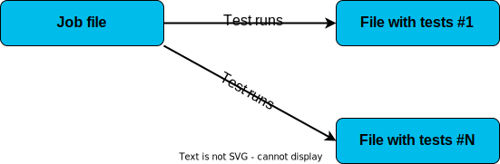

Step 1: Show the Results of Tests in a Browser
##############################################

**Value Proposition:** In this last task, we will see how to show the results of the tests in a more user-friendly way in a browser. For this, the pyats run job command will be used in a Bash shell.

When a test is run using **pyats run job** it adds the following advantages:

- Logs of test runs are saved into the archive
- Graphical representation of test results in a browser
- Ability to run tests in different Python scripts

To use **pyats run job**, a special file “job file” (written in Python) should be created.

A job file looks as shown below:

**<test_name1>** - specifies the path in the system to the Python file with the first list of tests (for example **task8_labpyats.py**).
**<test_name2>** - specifies the path to the Python file with the second list of tests (for example **task9_labpyats.py**).

The method **run** from the imported library **ats.easypy** instructs the system to run tests in sequence.

.. code-block:: python
    :emphasize-lines: 6-7, 10-11

    import os
    from ats.easypy import run

    def main():
        # Find the location of the script in relation to the job file
        <test_name1> = os.path.join('<file_with_tests1.py>')
        <test_name2> = os.path.join('<file_with_tests2.py>')
        
        # Execute the testscript
        run(testscript=<test_name1>)
        run(testscript=<test_name2>)

To call **pyats run job**, use the following command in a Bash shell:

.. code-block:: bash

    pyats run job <job-file> --testbed <testbed-file>

Schematically, the process of **pyats run job** can be shown as follows:

Let's use **pyats job run** to execute tests from Task 9. PyATS job file **task10_runtestsjob.py** has been pre-configured for this.

#. Open **runtestsjob.py** file in Nano and check it (the structure is in accordance with the one shown above).

    .. code-block:: bash

        nano task10_runtestsjob.py

#. Exit Nano without saving, pressing:

    .. code-block:: bash

        Ctrl+X

#. Execute the pyATS job file with the **pyats run job** command:

    .. code-block:: bash

        pyats run job task10_runtestsjob.py  --testbed pyats_testbed.yaml

#. After completion of the job, check the results:

    .. code-block:: bash

        pyats logs view

#. Google Chrome would be opened to show the last jobs run. Minimize Linux shell window.

    .. note::

        Don't close Linux shell, otherwise, it will stop the local pyATS web server.

    Click the upper line in a list to open results of the last job run:

    .. image:: images/viewer-list-of-jobs-run.png
        :width: 75%
        :align: center

#. Detailed results of the tests comprising the last run job would be shown.

    .. note::

        Pay special attention to the result of each test, which is shown along with start time and run time of each test.

    .. image:: images/pyats-log-viewer-results-page.png
        :width: 75%
        :align: center
    
    |

#. Click on the test **ping[dest_ip=10.0.0.17]** (see “1” on next figure), a detailed log from the execution of this test will be shown on the right side of the window (see “2”).

#. Click on the **PASSED** button for the test **ping[dest_ip=10.0.0.17]** (see “3” on next figure), ensure test passed message is shown (see “4”).

    |

    .. image:: images/pyats-log-viewer-ping-test-results.png
        :width: 75%
        :align: center
    
    |

    You can open detailed results of the last job, without opening the list of previous jobs, using the following command in shell:

    .. code-block:: bash

        pyats logs view -latest

    To test this option, follow the next steps.

#. Maximize Linux shell, minimized in step 5. Stop running pyATS web server:

    .. code-block:: bash

        Ctrl + C
    
    Open the web page with the detailed results of the last job:

    .. code-block:: bash

        pyats logs view -latest

    Ensure detailed results of the tests comprising the last run job would be shown right away.

#. Open Linux shell again, stop running pyATS web server:

    .. code-block:: bash

        Ctrl + C
    
.. tip::

    pyATS run is a very handy tool and it's recommended that you use it to run your pyATS tests.

    You might also check the official documentation for the details at this `site <https://pubhub.devnetcloud.com/media/pyats/docs/cli/pyats_run.html#pyats-run-job>`_.

.. sectionauthor:: Luis Rueda <lurueda@cisco.com>, Jairo Leon <jaileon@cisco.com>
